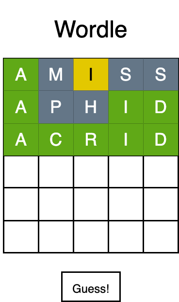
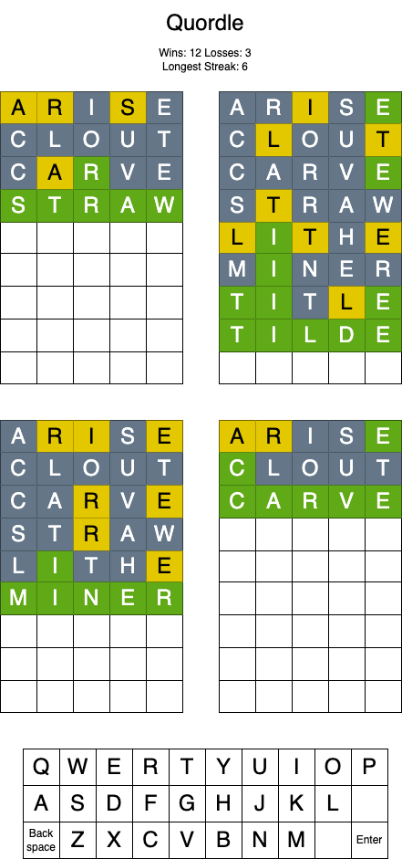

# Wordle
Wordle rose to prominence in late 2021 while most of the world was actively combatting the coronavirus pandemic. Artist and engineer Josh Wardle originally created Wordle for his partner, a word game enthusist, years earlier. Its gameplay mimics other games such as Jotto, the gameshow Lingo, and Mastermind. The New York Times purchased Wordle at the beginning of 2022, while Merriam-Webster purchased Quordle, a popular spin-off of Wordle.

Wordle is a single-player game in which the player tries to guess the secret 5-letter word.

To help the player guess the word, each letter of their incorrect guess displays in a color that hints towards the correct word. Letters that are not in the secret word display in dark gray boxes. Letters that are in the secret word, but not the correct location display in yellow boxes. Letters that are in the secret word and the correct position display in green boxes.

The game ends when the user guesses the word or loses by playing 6 incorrect guesses.

Unlike the New York Times' version, users can choose to play again with a new secret word, rather than waiting until the next day.

## Screenshots

## Technologies Used
HTML, CSS, JavaScript, DOM

## Getting Started

Click [me](https://caitlinfcorrigan.github.io/wordle/) to play!

You have 6 guesses to find the secret word! Each guess hints towards the word.
If your guess contains a letter in the same position as the secret word, it displays in green. If the secret word contains the letter in a differnt position, the letter displays in yellow. Letters not in the secret word display in gray.

## Next Steps
* Continue improving the logic to account for words that have repeated letters (like icily or eerie).
    * If the user's guess repeats a letter, but it only occurs once in the secret word, turn the second occurance gray.
* Add animation to reveal the correctness of a user's guess.
* Update the CSS to ensure the on-screen keyboard's letters always display in a square button instead of stretching.

## Planning Materials

### Wireframes

<!-- local image -->
 

### MVP Needs
* Generate a list of valid, 5-letter word from an English dictionary or other source
* Add the list of words to an array as uppercase strings
* Pick a secret word from the list
* Render the board as a grid of 6 rows of 5 squares (columns)
* Accept player guesses via keyboard; only accept letters (A-Z)
* As the player types, display the letter in uppercase in the current row (first guess is the top row)
* When the player clicks the Guess button or presses enter, validate that the guess is 5 letters and check that it is a valid word (find it in the list)
    * If it's not a word, clear the guess and display message "Not a valid word"
    * If it's a valid guess, compare the player's guess against the secret word and update the display as follows:
        * The letter is not in the secret word: Make the box dark gray
        * The letter is in the secret word, but the wrong position: Make the box yellow
        * The letter is in the secret word and in the correct position: Make the box green
* The player wins if they guess the secret word by the 6th guess
* The player loses if their 6th guess is incorrect
* At the end, display button to allow the player to play again with a new word

### Stretch Goals
* The game displays an on-screen keyboard which highlights guessed letters according to correctness:
    * Dark gray: Letter is not in the secret word
    * Yellow: Letter is in the secret word, but a different position
    * Green: Letter is in the secret word in the correct position
* The on-screen keyboard is clickable and contains both Enter and Backspace buttons
* The game counts the number of wins, losses, and longest streak
* Display game rules before the player can begin playing and include examples
* Animate the reveal of green/yellow letters after user clicks Guess

#### Big Stretches
* Display the keyboard with shifted letters, rather than as a plain grid
* Expand game to Quordle:
    * Display 4 grids and generate 4 secret words
    * Every guess evaluates against all 4 words
    * The player wins if they guess all 4 secret words by their 9th guess
    * Letters on the keyboard havee quadrants corresponding to a gameboard and the letter's correctness
* Shrink the heigh of past guesses; only display current guess in squares
* Display the four grids across the screen if it's a desktop (in mobile, display as 2x2 grid)

### Potential Roadblocks
* Loading the word list into memory
* Rendering an on-screen QWERTY keyboard with Return/Enter and Backspace keys
* Accepting keyboard and on-screen inputs
* Quordle: Updating 4 grids from a single guess